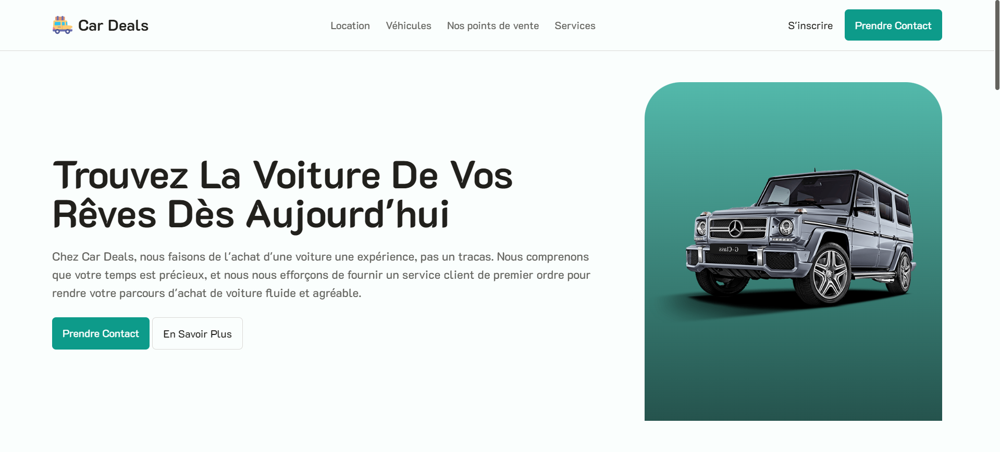
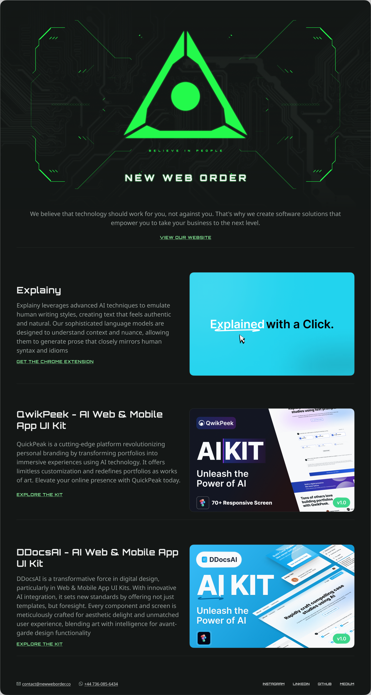

# Car Deals Website

Car Deals is a website, or more precisely a landing page, based on car dealership. It contains a navigation bar, cover, car grids, step-by-step diagrams and much more. The site is completely responsive in mobiles or tablets. It was developed using the Nuxt.JS framework.

## Setup

To install the dependencies:

```bash
# npm
npm install

# pnpm
pnpm install

# yarn
yarn install
```

Start the development server :

```bash
# npm
npm run dev

# pnpm
pnpm run dev

# yarn
yarn dev
```

## Technologies used

Here are the different technologies I decided to use for this project :

- Nuxt.JS (Framework)
- Swiper
- Tailwind CSS
- Lucide Icons
- Nuxt Google Fonts

## Figma KIT

This website could not have been designed without [syedsaif666](https://github.com/syedsaif666)'s figma file.


